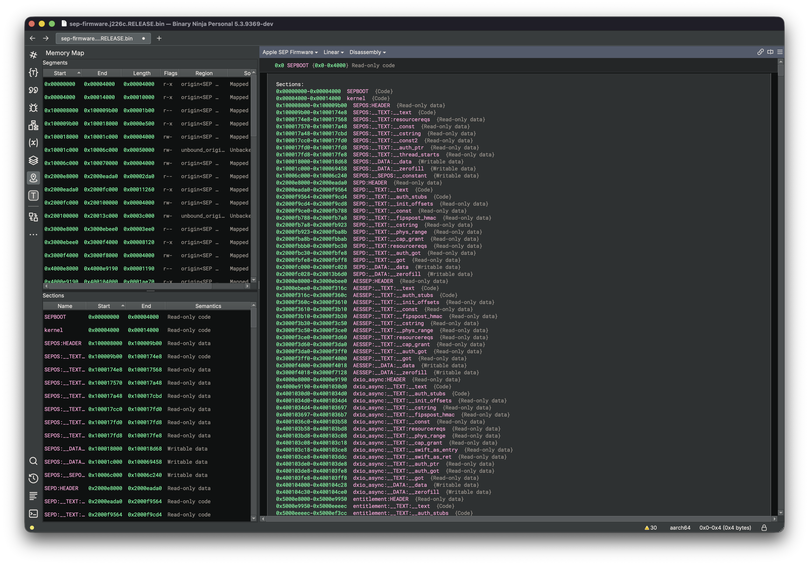
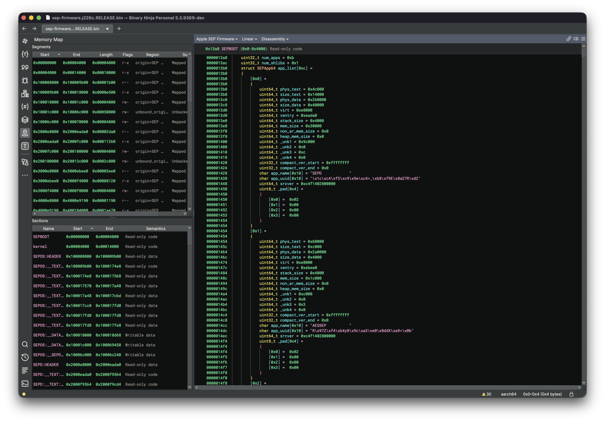

# SEP-binja

SEP firmware loader

### Description

Loads Apple SEP firmware, splitting it into individually addressed Mach-O modules.

Parses the Legion2 SEP firmware header, extracts every embedded Mach-O (boot stub, kernel, SEPOS root-server, all SEP apps, shared library), maps each one at a distinct 4 GiB-aligned virtual address range, creates properly typed sections, adds entry points, symbols, and optionally resolves shared-library GOT references. No external dependencies.

Also defined structs in the BinaryView.

### Install

- MacOS: Copy to `~/Library/Application Support/Binary Ninja/plugins/` or use Plugin Manager
- Windows : Copy to `%APPDATA%\\Binary Ninja\\plugins` or use Plugin Manager
- Linux : Copy to `~/.binaryninja/plugins/` or use Plugin Manager

### Credits
- [plzdonthaxme](https://x.com/plzdonthaxme) for [sepsplit-rs](https://github.com/justtryingthingsout/sepsplit-rs) as this project is **heavily** inspired from his project
- [Proteas](https://x.com/ProteasWang) for the idea of [sep-fw-dyld-cache-loader](https://github.com/Proteas/sep-fw-dyld-cache-loader) as the objective of this project is to do the exact same thing but for Binja
